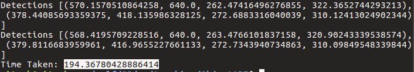
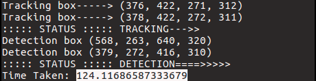

# Object-Detection-and-Tracking
The main problem in object detection is that it is very slow as for each frame we do the prediction 
and it adds too much overhead in time.

The above problem can be solved to an extent by including tracking along with detections.

The detections happens here for every 30 frames and then passes the detected bounding boxes along with the particular input frame 
to the tracking module.

There are various tracking algorithms available online but there is no such implementation of multiple objects tracking. 
In order to track various multiple objects, I have made use of the multiprocessing module in python 
where in for every detected objects I create a process which handles the tracking part and its keep updating the bounding box position.

Areas of improvement:
The processes are continuosly being created for every object and even the object goes out of scope the process is still running,
So I have to look into how to terminate the process if the objects goes out of scope. 

As seen in the screenshot **Detection takes 194 secs** where as **Detection along with tracking takes only 124 secs**.
However Again there is a trade off between the accuracy and the speed. The Detection is very accurate for each frames
where as we see a lot of false examples in Detection + Tracking.
**Detection**

**Detection along with tracking**

**Detection along with Trcaking Output**

